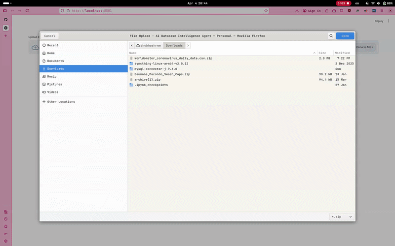

# AtlasDB – AI-Powered Database Intelligence Tool

AtlasDB transforms raw relational databases into structured insights, visualizations, and AI-generated documentation — instantly.


##  Features

- **Dataset Upload**  
  Upload relational databases as a ZIP of CSV tables.

- **AI Summary**  
  Generates concise, business-friendly database overviews.

- **Interactive Graph + ER Diagram**  
  Explore table relationships through knowledge graphs and structured ER diagrams.

- **Schema Overview**  
  View tables, columns, data types, constraints, missing values, and uniqueness.

- **AI Data Dictionary**  
  Human-readable descriptions for each column.

- **Data Quality Metrics**  
  Completeness, duplicates, memory usage, and column-level statistics.

- **Business Insights**  
  AI-generated high-level interpretations of the dataset.

- **Downloadable Report**  
  Export a PDF containing schema, diagrams, insights, and analysis.

- **Chatbot Prototype**  
  Sidebar interface for querying the database *(UI only, no AI integration yet)*.

---

##  Performance & Optimization

- **Cached AI Outputs**  
  AI-generated summaries, dictionaries, and insights are cached using `st.session_state` to avoid redundant API calls.

- **Single-Pass AI Processing**  
  Entire schema is processed in a single API call instead of per-table requests.

- **Efficient Data Profiling**  
  Schema and quality metrics are computed in minimal passes using Pandas.

- **Fallback Handling**  
  Ensures all columns receive descriptions even if AI output is incomplete.

> AtlasDB is optimized for fast, cost-efficient, and scalable database analysis.


##  Demo




##  Project Structure

```
AtlasDB/
│
├─ app.py
├─ demo.gif
├─ modules/
│   ├─ schema_extractor.py
│   ├─ graph_builder.py
│   ├─ dq_metrics.py
│   ├─ report.py
│   └─ bi_insights.py
├─ requirements.txt
└─ README.md
```

##  Tech Stack

- **Frontend:** Streamlit  
- **Backend:** Python, pandas  
- **Visualization:** pyvis, graphviz  
- **AI Layer:** GROQ (LLM API)  
- **Reporting:** markdown + WeasyPrint  


##  Installation

1. **Clone the repository**
2. **Create virtual environment**
3. **Install dependencies**

```bash
pip install -r requirements.txt
````

Or manually:

```
streamlit
pandas
pyvis
graphviz
weasyprint
groq
markdown
```


##  API Setup

Create a `.streamlit/secrets.toml` file in project directory:

```toml
GROQ_API_KEY = "your_api_key_here"
```

Use in code:

```python
from groq import Groq
client = Groq(api_key=st.secrets["GROQ_API_KEY"])
```


##  Run the App

```bash
streamlit run app.py
```


##  Notes

* AI-generated outputs depend on dataset quality and schema clarity.
* ER diagrams are automatically generated and included in reports.
* Chatbot is currently a **UI prototype** (no backend processing yet).

## License

This project is licensed under the [MIT License](LICENSE).


